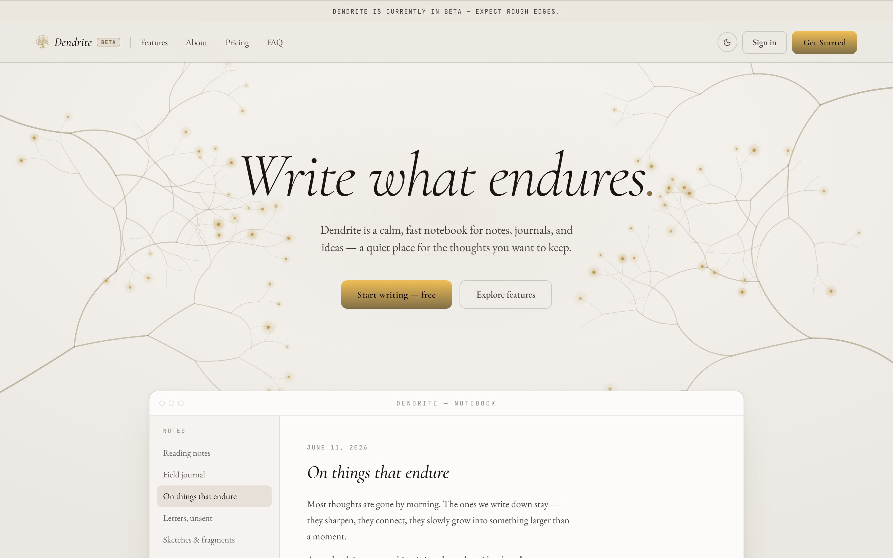
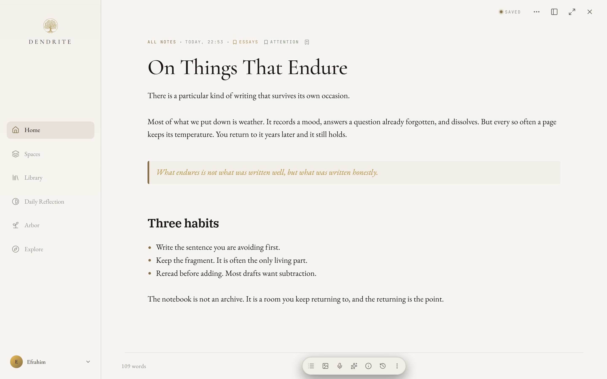
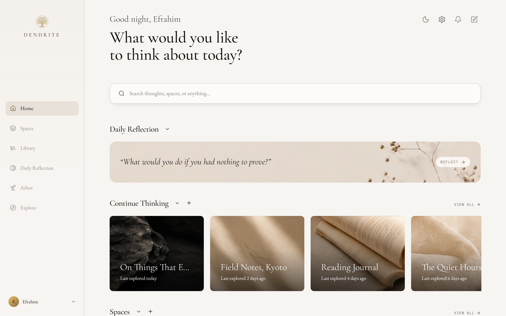
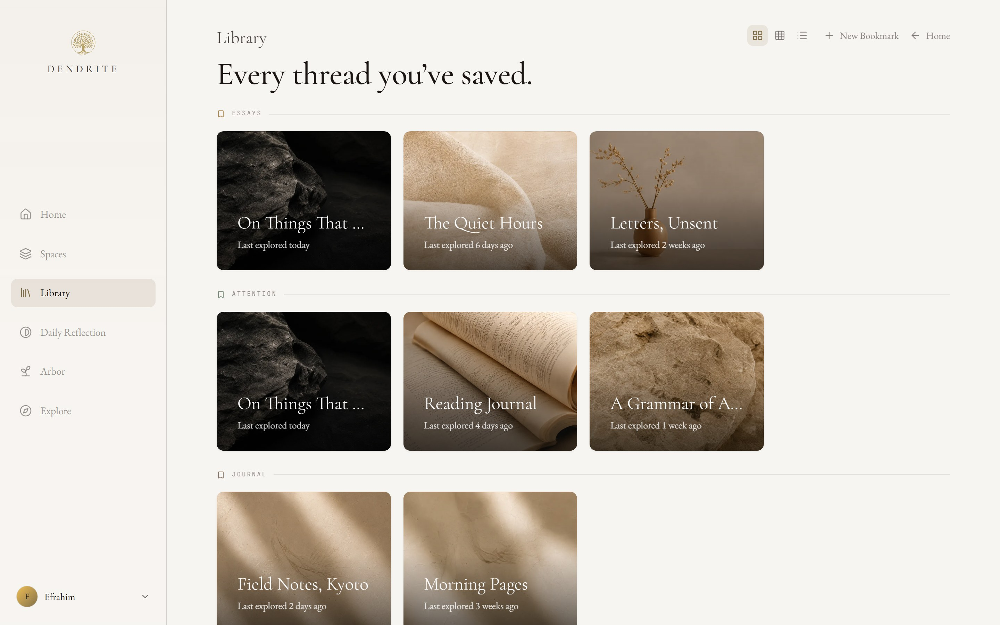
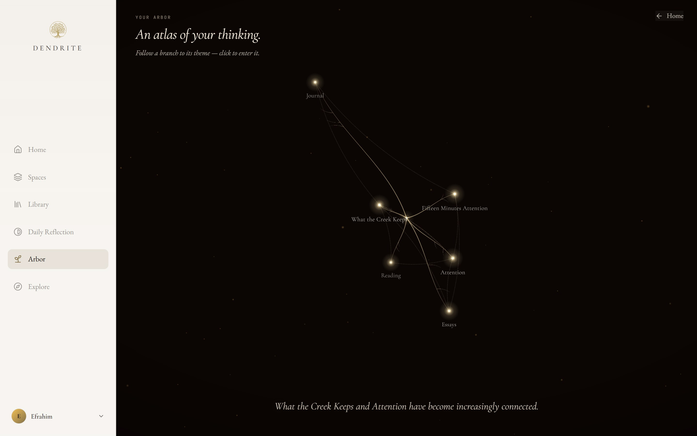
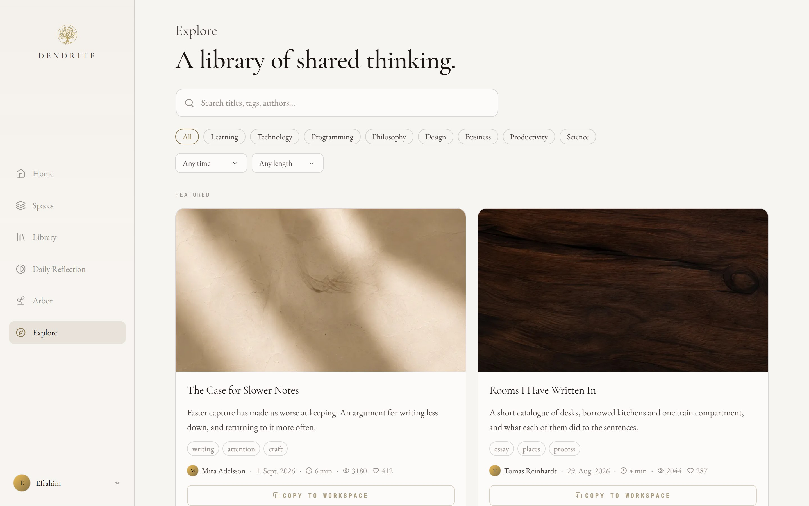

# Dendrite

### Write what endures.

A calm, fast notebook for notes, journals and ideas —
a quiet place for the thoughts you want to keep.

**[dendrite-notes.com](https://www.dendrite-notes.com)** · currently in beta

---

Most note apps are built for capture. Dendrite is built for keeping — for the
notes you come back to. It is a full writing environment: a rich-text editor
that stays out of the way, real-time collaboration, a place to publish what is
worth sharing, and a map of the themes your own writing keeps returning to.

---

## Write

A Lexical-based editor with headings, lists, tables, checkboxes, images and
drop caps. The toolbar is yours to rearrange. Dictate a passage and it is
transcribed as you speak; ask for a summary and Claude writes one. Everything
autosaves.

## Return

Home opens on the thoughts you left unfinished, one reflection question a day,
and the spaces your writing lives in.

## Keep

Bookmarks group notes across spaces and folders — every thread you have saved,
in one library.

## Map

The Arbor reads the themes running through your notes and draws them as
branching growth. Follow a branch to its theme and enter it.

## Share

Publish a note and it becomes part of Explore, where other people's writing can
be read, liked and copied into your own workspace.

---

## Features

**Writing** — rich-text editor, drop caps, tables, checklists with timers,
image and file attachments, per-note covers, version history, PDF export,
voice dictation, AI summaries

**Organising** — spaces, nested folders, bookmarks, pinning, favourites,
full-text search, reminders, trash with 30-day recovery

**Together** — real-time collaboration over WebSocket with live presence,
invitations with per-note roles, follows and notifications

**Discovering** — publish to Explore, topic and length filters, trending and
featured, likes, public profiles

**Reflecting** — a daily question and the Arbor's map of recurring themes

**Account** — email and OAuth sign-in, email verification, password reset,
two-factor authentication, Stripe subscriptions

---

## Built with

React · TypeScript · Vite · Tailwind CSS · Lexical · Yjs · GSAP · Three.js
Node · Express · Prisma · PostgreSQL · Docker

Setup, architecture, project structure and deployment are documented in
**[DOCS.md](DOCS.md)**.

---

## License

MIT
